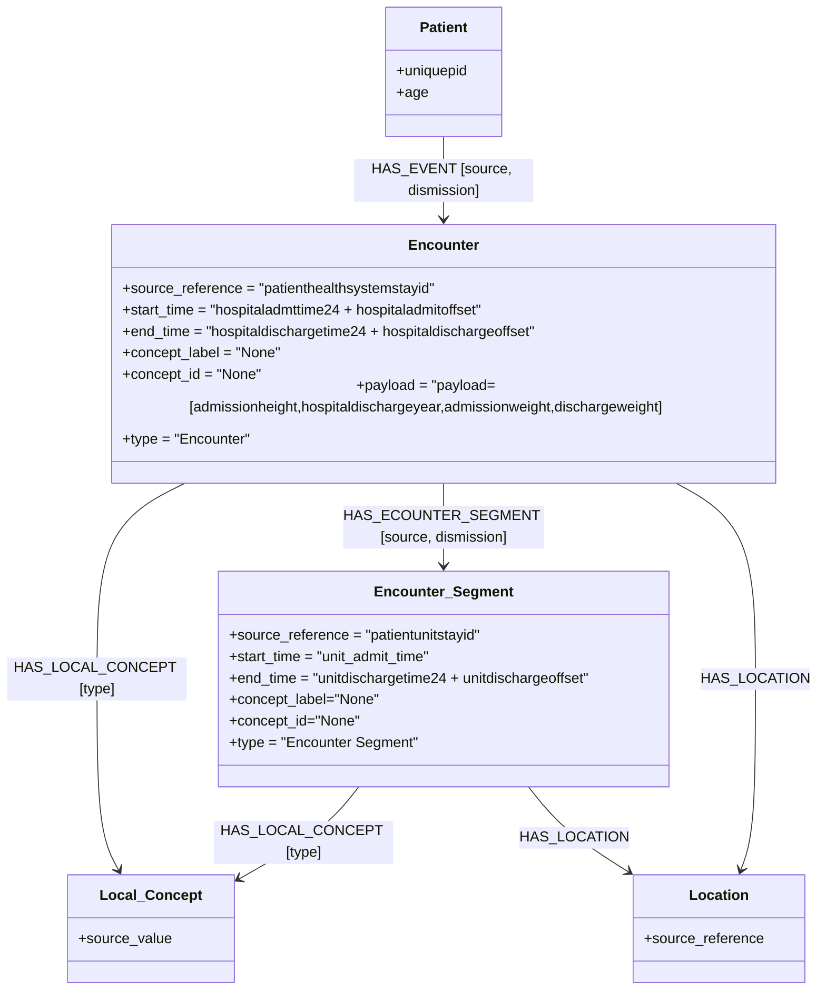

# Mediverse — eICU → Neo4j Loader

Loads the **eICU Collaborative Research Database** `patient.csv` into a Neo4j graph
fully driven by `mapping.json`, with no hard-coded Cypher.

---

## Project Structure

```
project-root/
│
├── mapping.json           # Graph mapping definition (nodes + relationships)
├── README.md              # This file
├── docker-compose.yml     # Neo4j + loader services
├── requirements.txt       # Python dependencies
├── toy_loading_patient_csv.py  # ETL loader script
└── neo4j/
    ├── import/            # Drop sample / full CSV files here
    └── scripts/           # Cypher utility scripts
```

---

## E-R Diagram



# 1. Drop the eICU patient.csv into neo4j/import/
cp /path/to/eicu/patient.csv neo4j/import/

# 2. Start Neo4j + run the loader
docker compose up

# 3. Open the browser
open http://localhost:7474


Default credentials: `neo4j / Mediverse`

---

## Mapping

All graph topology is defined in `mapping.json`:

| Key | Purpose |
|-----|---------|
| `nodes` | Node labels, source CSV keys, properties, timestamps, payloads |
| `relationships` | Edge types, join keys between node pairs |

To extend the model, add entries to `mapping.json` — no code changes needed.

---

## Requirements

- Docker + Docker Compose
- eICU `patient.csv` (place in `neo4j/import/`)
